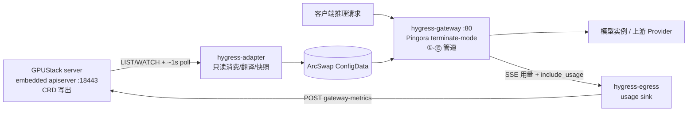
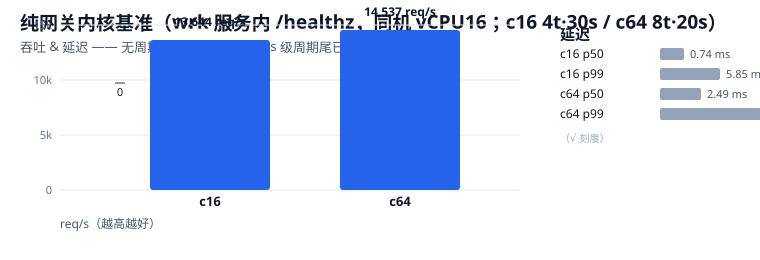
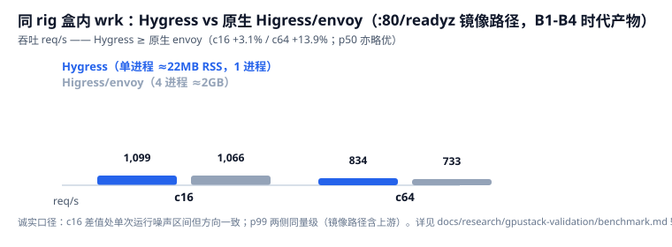
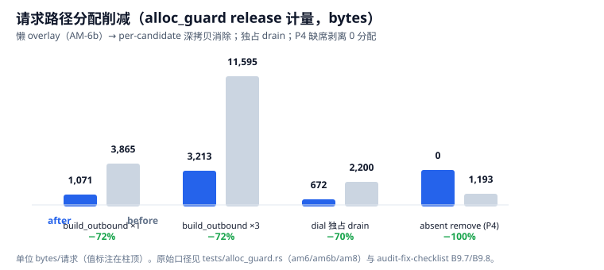
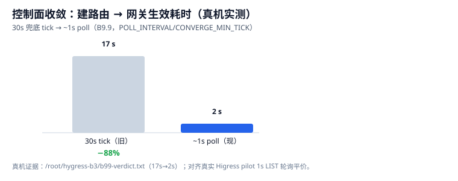

# Hygress：基于 Pingora 的 GPUStack 内嵌 Higress 原位替换 AI Gateway

> 用 Rust（Cloudflare Pingora）实现的轻量 AI Gateway，在 GPUStack 中**原位（in-place）替换**其内嵌 Higress
> 三进程（pilot / controller / envoy gateway），**不改 GPUStack 一行 Python**。单二进制 terminate-mode
> 数据面 + 只读控制面（kube CRD 消费 / 原生命中映射 / SSE 用量注入与核算）。

- **状态**：真机 A/B 验证通过（live GPUStack v2.2.3 `gateway_mode=embedded` + RTX4090 worker + qwen2.5-0.5b-instruct）
- **版本**：**v0.1.0（冻结版，tag `v0.1.0`）** —— 发布记录 `docs/RELEASE-v0.1.0.md` · 变更明细 `CHANGELOG.md`
- **收敛**：多轮 oracle 审核闭环，**ora-6 五维 = 成熟度 9.5 / 质量 9.5 / 性能 9.6 / 可运维 9.5 / GPUStack 集成 9.5**（无 BLOCK）
- **门禁**：**661 tests 全绿**（`cargo test --workspace --all-features`；含 39 真实 e2e）· clippy 双模式 0 ·
  `cargo doc -D warnings` 0（四 crate `#![warn(missing_docs)]`）· alloc_guard release 12/12

---

## 1. 它是什么 / 为什么

GPUStack 内嵌的 Higress 由 pilot + controller + envoy 三进程构成（≈2GB 常驻、Wasm 插件链、Go 扩展栈）。
Hygress 把同一条 **Higress-CRD → 数据面** 语义用 Rust 重写进**一个进程**（Pingora 终止模式数据面，实测 ≈22MB RSS）：

| 维度 | 原生 Higress/envoy | Hygress |
|---|---|---|
| 进程/常驻 | 4 进程 ≈2GB | **1 进程 ≈22MB** |
| 扩展栈 | Go + Wasm 桥接 | 全 Rust（`async` / 无锁 `ArcSwap` 热重载） |
| 数据面 | Wasm 插件链多跳 | Pingora 单跳原生管道（吞吐 ≥ envoy、p50 略优，见 §3） |
| 集成面 | GPUStack 内置逻辑 | 不改 GPUStack：只读 CRD + 字节级等价 wire 契约 |

四 crate 分层（`hygress-core` 纯领域无 I/O；`adapter`/`egress` 仅依赖 core；`gateway` = 数据面+容器入口，
`integrations` 为默认 feature）。



## 2. 关键能力（v0.1.0）

- **数据面**：入站剥离/模型路由/变换/路由匹配/SWRR/模型改写/`include_usage` 注入（AM-2 memo，字节精确）/
  流式响应+SSE 用量吸收/4xx-5xx fallback（预算有界）/TLS-SNI。
- **用量核算**：模型路由行推送 GPUStack（`completed=true` 精确 / 上游无 usage 时服务端估算），17 字段 wire 与
  plugin-contract-pin 逐字节一致；真实 llama-box 引擎判别真机实证（b100）。
- **控制面**：拓扑 A（embedded）~1s 轮询收敛（建路由→生效 ≈2s）；拓扑 B（external）WATCH 事件快路径 + 轮询兜底；
  `POLL_INTERVAL` 可调（下限 1s）；指纹短路稳态零重算。
- **延伸能力**（`hygress.policy.yaml` 驱动，mtime ≤30s 热重载 + admin `/reload` 即时）：限流（IP/consumer 令牌桶）、
  token 配额（soft/hard）、路由策略覆盖（override/pin/头/超时/重试）、安全护栏（静态规则 + LLM 判定 + 输出侧逐块断流）。
- **可观测**：`/metrics`（28+ 家族：请求/延迟/令牌/审计/护栏/用量推送与控制面心跳·错误·重载）· 启动摘要（version /
  contract_pin / 脱敏配置）· 结构化日志（限速/退避/每 episode warn-once）。
- **安全**：admin `/reload`·`/config` token 门禁（缺省 401 fail-closed）· ext-auth 默认 closed（403）· 密钥日志脱敏 ·
  panic hook → exit(1) 由 s6 重启。

## 3. 性能基准（真机 wrk，图表化）

口径与原始证据：`docs/research/gpustack-validation/benchmark.md`（§1-§11 全曲线与诚实说明）、
`fixtures-hygress/bench_kernel_healthz_c{16,64}.txt`、`perf-tail-plan.md`。

**① 纯网关内核（服务内 wrk 打 `/healthz`，同机 vCPU16）——平坦、无周期尾部**



**② 同硬件盒内 wrk（Hygress 单进程 vs 原生 Higress/envoy，`:80/readyz` 镜像路径）**



**③ 请求路径分配削减（alloc_guard release 计量，bytes/请求）**



**④ 控制面收敛（建路由 → 网关生效，真机）**



诚实说明（务必读）：
- §① 为纯网关内核隔离口径（无上游）；§② 为含 GPUStack 镜像上游的整链口径，p99 两侧同量级（含上游因素），判据取
  req/s 与 p50。§② 为 B1-B4 时代产物与 envoy 的同 wrk A/B，方向结论不变。
- 模型推理路径受 GPU 模型约束（单测参考：POST /v1/chat/completions ≈6.65 req/s、p50 ~295ms），非网关瓶颈。
- 分配削减为可复现的进程内计量（`cargo test -p hygress-gateway --release --test alloc_guard -- --test-threads=1`）。

## 4. 快速开始（部署 / 验证 / 回滚）

```bash
# 1) 构建单二进制（Rust 1.98+；workspace rust-version = 1.89；交叉产物：
#    PATH=/opt/homebrew/bin:$PATH cargo zigbuild --release -p hygress-gateway --target x86_64-unknown-linux-gnu）
cargo build --release -p hygress-gateway --features integrations
cp target/release/hygress-gateway target/release/hygress

# 2) 定制镜像（s6 手术在镜像层完成；可选 --build-arg GPUSTACK_TAG=latest 指定基础标签）
docker build -f pack/Dockerfile.hygress -t gpustack:hygress .

# 3) 参数化 compose（替换模板变量 / .env 后使用）
cp pack/compose-hygress.template.yaml compose-hygress.yaml   # 填 ${IMAGE_TAG} ${HYGRESS_ADMIN_TOKEN} 等
docker compose -f compose-hygress.yaml up -d gpustack-server # worker/数据卷不动

# 4) 验证
curl -s -o /dev/null -w '%{http_code}\n' http://127.0.0.1:80/readyz                 # 200
curl http://127.0.0.1:80/v1/chat/completions -H "Authorization: Bearer <api_key>" \
  -H "Content-Type: application/json" -d '{"model":"qwen2.5-0.5b-instruct","messages":[{"role":"user","content":"Hi"}],"stream":false}'

# 5) 回滚：server 镜像切回 quay.io/gpustack/gpustack:latest 重启即可；或换任一 gpustack:hygress-b* 回滚镜像
```

要点与文档化约束：
- `pack/Dockerfile.hygress` 把 `gateway/run` 改写为 Hygress 启动器（env 注入、日志
  `$GPUSTACK_DATA_DIR/log/hygress.log`、`access.log` 兼容 touch）；pilot/controller 槽位 no-op + 就绪字节；
  原始 scripts 备份在 `s6-rc.d.dist/`。
- **默认无 TLS Secret 时 `https://host:443` = connection refused**（GPUStack 仅以 `--ssl-keyfile/certfile`
  启动才写 managed TLS Secret）；SNI 仅服务默认/首主机证书；证书轮换需重启容器 —— 见 `pack/hygress-s6/README.md`。
- 端口纪律：数据面 80/443、admin/metrics 127.0.0.1:8081、stats 15020（无鉴权、勿出公网）；不监听
  9876/15010/15012/8888/15051。

## 5. 配置（重要环境变量）

launcher（`pack/hygress-s6/.../gateway/run`）自动注入，均可覆盖；完整解析在 `config.rs`。

| 变量 | 默认 | 说明 |
|---|---|---|
| `GATEWAY_HTTP_PORT` / `GATEWAY_TLS_PORT` | 80 / 443 | 数据面端口（launcher 双名导出） |
| `GPUSTACK_API_PORT` | 30080 | GPUStack API 端口（就绪探测/转发）。注：裸跑二进制未设 env 时为 80 |
| `GPUSTACK_DATA_DIR` | `/var/lib/gpustack` | **必须注入**：`{data_dir}/jwt_secret_key` 密钥解析 |
| `GPUSTACK_JWT_SECRET_KEY` | 无 | 缺省回退读 `{data_dir}/jwt_secret_key` 文件；两者皆无 → 启动 fail-fast |
| `HYGRESS_ADMIN_ADDR` | 127.0.0.1:8081 | admin/metrics（loopback；/healthz、/metrics 公开）。勿暴露到非本机 |
| `HYGRESS_ADMIN_TOKEN` | 无（**默认不注入**） | 缺省 ⇒ `/reload`、`/stats/usage`、`/config` = **401 fail-closed**；生产注入随机值 |
| `GATEWAY_PILOT_AGENT_METRICS_PORT` | 15020 | stats 浅兼容（无鉴权） |
| `POLL_INTERVAL` | 1s | 控制面收敛轮询（下限 1s）；拓扑 A = 传播主路径（≈2s 生效），拓扑 B = WATCH 兜底 |
| `HYGRESS_TOPOLOGY_B` | 关 | **仅 external 集群置 true**（播种 IngressClass）；拓扑 A 必须保持关闭（零写） |
| `HYGRESS_POLICY_PATH` | `/etc/hygress/policy.yaml` | 延伸能力配置（mtime ≤30s 热载 + `/reload` 即时；缺/坏 → 默认放行 / 保 LKG） |
| `HYGRESS_QUOTA_K` | 4 | 配额预留估算分母 `est=ceil(body_bytes/K)` |
| `HYGRESS_GUARDRAIL_URL` | 无 | LLM 护栏判定服务（未设 ⇒ LLM 护栏未配置 → 直通） |
| `HYGRESS_EXT_AUTH_FAIL_MODE` | `closed` | ext-auth 不可达/5xx：closed=403（默认）/ open=旧 fail-open |
| `HIGRESS_EXT_AUTH_TIMEOUT_MS` | 30000 | ext-auth 超时（**拼写是 `HIGRESS_` 前缀**；`HYGRESS_` 拼写不被读取） |
| `HYGRESS_API_READY_TIMEOUT` / `HYGRESS_SNAPSHOT_TIMEOUT` | 30s / 60s | 启动窗口 |

## 6. 运维与可观测

- 端点：`/healthz`（进程活）· `/metrics`（开放）· `/reload`/`/config`/`/stats/usage`（token 门禁）·
  `:15020 /stats[/prometheus]`（浅兼容）；数据面仅在首个快照后 bind（fail-fast）。
- 指标族示例：`hygress_requests_total{status,kind}` · `usage_pushed_total{completed}` · `usage_push_dropped_total`
  · `control_last_sync_timestamp_seconds`（心跳）· `control_reconcile_error_total` · `policy_reload_total{result}`
  · `guardrail_error_total` · `auth_decisions_total{result}` · `upstream_errors_total{destination}` ·
  `build_info{version}` …
- **指标目录 / PromQL 告警 / 事故 runbook / 升级重启矩阵 / 日志语义**：`docs/operations.md`。
- 升级契约复核：启动日志 `contract_pin` 指向 `docs/research/plugin-contract-pin.md` §7 重跑清单。

## 7. 质量、审计与发布

- 门禁：661 tests（39 e2e、12 alloc_guard 预算）· clippy 双模式 0 · `cargo doc -D warnings` 0。
- 收敛：ora-2 → ora-4（≈8.6）→ **ora-6 五维 ≥9.5**（逐轮修复-复核见 `docs/research/audit-*.md` 与
  `audit-fix-checklist.md` B1-B10）。性能收尾：memchr（P6）、absent-aware COW + 惰性入站头（P4）、
  AM-2 memo、指标句柄缓存、ring-only TLS（无 aws-lc）。
- 版本：v0.1.0 冻结 —— `CHANGELOG.md` / `docs/RELEASE-v0.1.0.md`；真机镜像链 b100..b105 + 回滚 tag 在案。

## 8. 文档索引

- `docs/design.md` · `docs/operations.md`（运维/指标/runbook）· `docs/dev-process.md`
- `docs/extensions-audit.md` / `docs/extensions-design.md`（延伸能力）
- `docs/research/plugin-contract-pin.md`（字节级外部 wire 契约）
- `docs/research/audit-oracle-review[-ora3/-ora4/-ora5].md` + `docs/research/audit-fix-checklist.md`（审计与修复记录）
- `docs/research/gpustack-validation/`（真机验证 REPORT + benchmark.md + fixtures）
- `pack/`（Dockerfile.hygress + s6 手术 + compose 模板 + TLS runbook）· `docs/img/`（基准图表）
